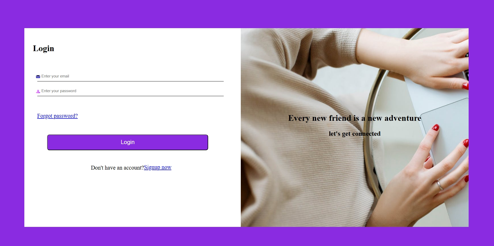
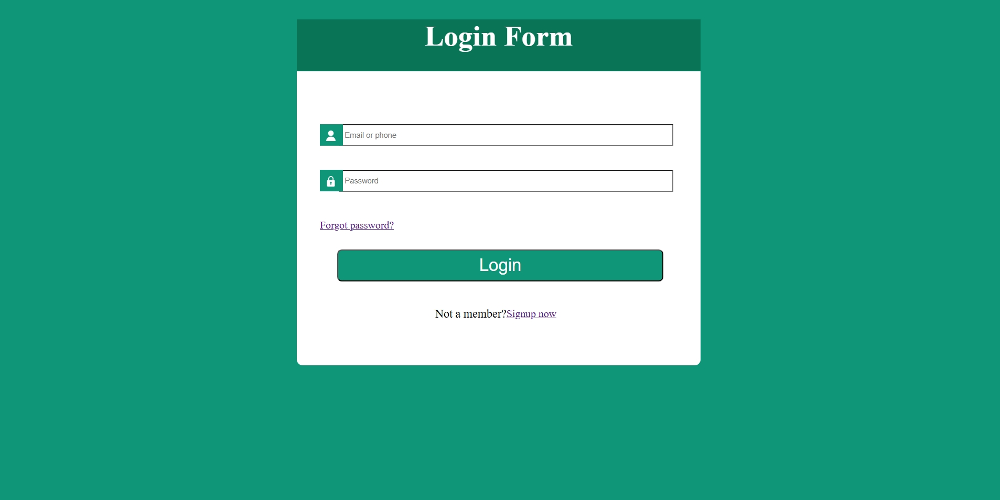
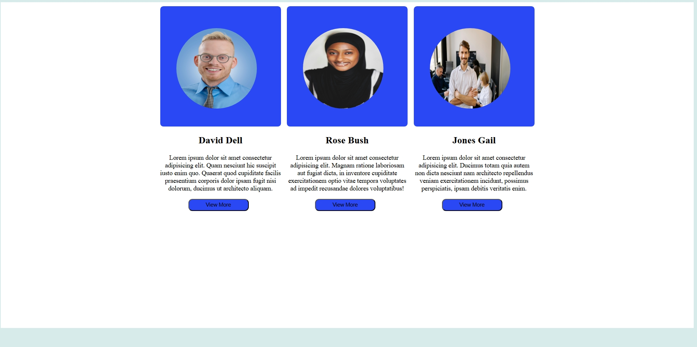
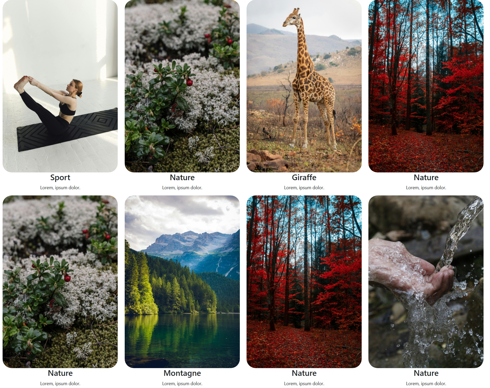

## EXO HTML CSS
Description: ce dossier contient des exercices sur la reproduction de designs en utilisant le html et le css, aussi les frameworks du css qui sont le tailwind et le bootstrap.
## Exo1
Description: cet exercice concerne la reproduction d'un design en utilisant du html et du css.
## Capture d'ecran

## CSS: j'ai utilisé les propriétes display, flex-direction, background-color, background-image, width, height, padding,margin etc...

## Exo2
Description: cet exercice constitue la reproduction d'un design ayant la presentation d'un formulaire en utilisant du html et du css.
## Capture d'ecran

## CSS: les propriétés les plus courants que j'ai eu à utiliser sont le background-color, display, flex-direction, width, height, padding,margin, justify-content.

## Exo3
Description: cet exercice constitue la reproduction de trois cartes d'utilisateurs en utilisant le html et du css.
## Capture d'ecran

## CSS: les propriétés les plus courants que j'ai eu à utiliser sont le background-color, display, flex-direction, width, height, padding,margin, justify-content, border-radius.

## Tailwind
Description: cet exercice s'accentue à reproduire des cartes d'utilisateurs en utilisant du tailwind qui est un framework css.
## Capture d'ecran

## CSS: les propriétés utilisées pour ce framework sont le flex, flex-col, items-center, justify-center,rounded-full, border,bg-* etc...

## Bootstrap
Description: cet exercice a pour but de reproduire une gallery d'images en utilisant le systeme de grille de bootstrap.
## Capture d'ecran

## CSS: les propriétés utilisées pour ce framework sont container-fluid, row, col, row-cols-lg-4,img-fluid, rounded-5,object-fit-cover, w-100 etc...